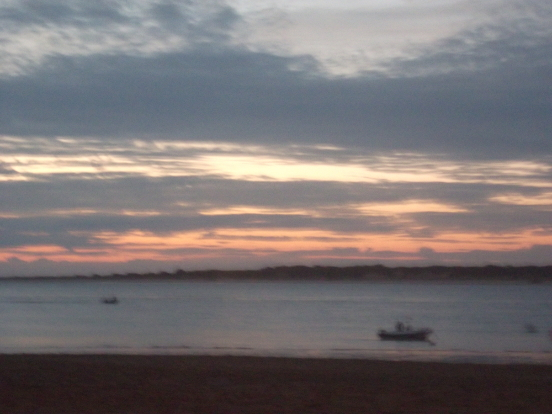
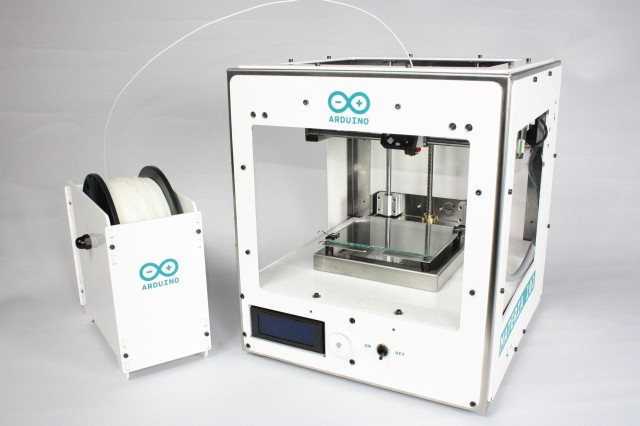

# amaiam


Dit is mijn eerste website.

Een foto van mij:



##code truukjes

ik heb ze van Richel


Een lijst gaat zo:

 * A
 * B
 * C

Een stukje code gaat zo:

```
void setup() 
{

}

void loop()
{

}
```


Dit is een wat oudere foto op het orbit festival in groningen.
met Richel,Noemie,Redmar en ik


we legden arduino uit en ik ben die met dat grijze vest.
ik leg al iets uit aan een mevrouw.

het was erg leuk om arduino uit te leggen aan zoveel mensen en iedereen vond het heel gezellig

We hopen natuurlijk dat er zoveel mogelijk nieuwe mensen kwamen en komen bij de arduino course.

16 april 2016 is er een open dag bij de jonge onderzoekers.

je kunt er van alles doen met arduino en met andere dingen.
van 10 tot 4 uur is het open.
daarna sluiten ze.
noemie redmar peter thijs yinn en ik zijn er ook.

het gaat heel erg goed en het is erg gezellig.
we hebben veel gegeten zoals pannenkoeken en een hotdog.
we hebben veel mensen arduino geleerd.
en ze vonden het erg leuk.

ik was gisteren bij de cursus en ik ben bezig om 12 piano toetsen te maken.
ik ben nog niet zo ver maar ik vind het wel leuk om te doen.
en ik leerde iemand solderen dat was leuk.

21 mei 2016 staat de arduino cursus op de maakplek
bij het station in een oud postkantoor.
het is van 1 tot 6 en er staan ook nog andere hele gave dingen.
dit is een foto bij de maakplek.

we waren buiten omdat het brand alarm afging maar gelukkig kwam het door een machine die iemand had gemaakt die rook gebruikte.

hallo vandaag maken noeimie en ik een robot die een kat gaat worden.

hallo vandaag is het vrijdag 15 september.
ik en noemie zijn nog steeds bezig met onze robot,die als een kat moet gaan rijden en uiteindelijk een zaklamp gaat volgen.
want we zijn erg lang met vakantie geweest dus kunnen we pas vandaag echt goed beginnen.
als hij klaar laat ik wel een foto zien en leg ik wat erover uit.




dit is een arduino 3D printer 


 


